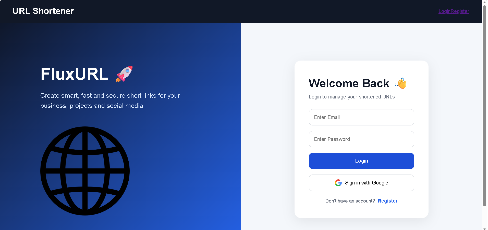
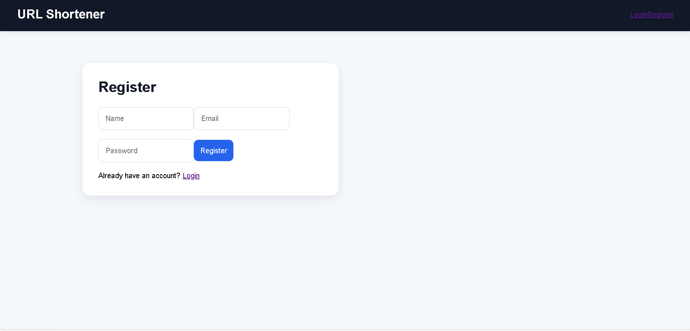
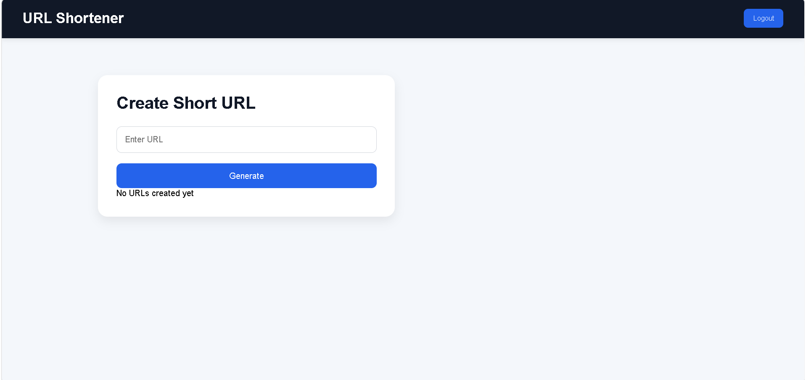
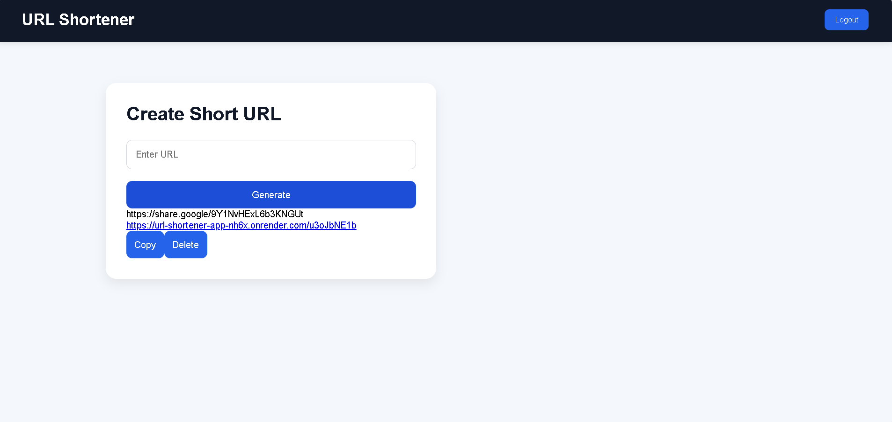
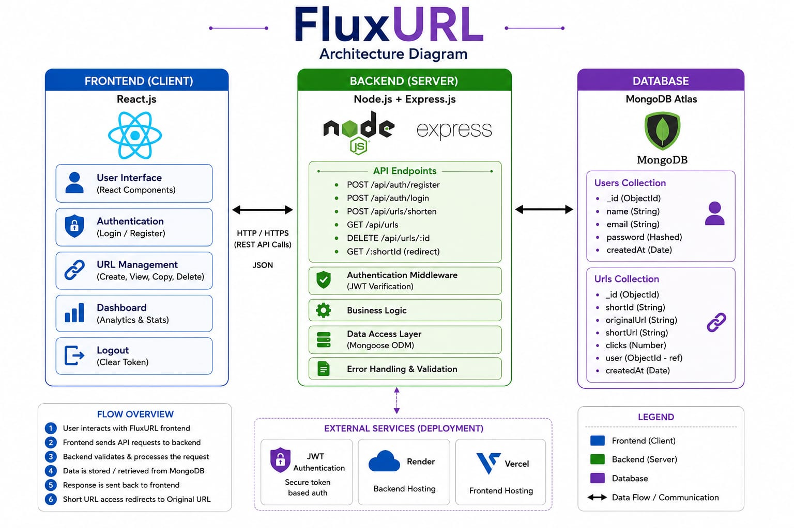

# URL Shortener App

A full-stack URL Shortener web application built using the MERN stack.

## Live Demo

Frontend:
https://your-frontend-url.vercel.app

Backend:
https://url-shortener-app-dgm9.onrender.com

GitHub Repository:
https://github.com/sangaviasokan-a/url-shortener-app

---

# Features

* User Registration
* User Login with JWT Authentication
* Secure Password Hashing
* Create Short URLs
* Redirect to Original URLs
* MongoDB Database Integration
* Protected Dashboard
* Responsive UI
* REST API Backend
* Deployment using Render and Vercel

---

# Tech Stack

## Frontend

* React.js
* React Router DOM
* Axios
* CSS

## Backend

* Node.js
* Express.js
* MongoDB Atlas
* Mongoose
* JWT Authentication
* bcryptjs
* nanoid

## Deployment

* Render
* Vercel
* GitHub

---

# AI Planning Document

## Step 1 — Planning the Application

The goal of this project was to build a secure and scalable URL shortening platform where users can:

* Register/Login securely
* Create shortened URLs
* Store URLs in MongoDB
* Redirect users using short IDs
* Track URL ownership

---

## Step 2 — Feature Planning

### Authentication Features

* Register new users
* Login existing users
* JWT token authentication
* Protected routes

### URL Features

* Create short URLs
* Redirect to original URLs
* Store URLs with user IDs
* Dashboard to manage URLs

### Deployment Features

* Frontend deployment using Vercel
* Backend deployment using Render
* MongoDB Atlas cloud database

---

# Application Architecture

```txt
Frontend (React)
       ↓
Axios API Requests
       ↓
Backend (Node.js + Express)
       ↓
MongoDB Atlas Database
```

---

# Setup Instructions

## 1. Clone Repository

```bash
git clone https://github.com/sangaviasokan-a/url-shortener-app.git
```

---

## 2. Install Frontend Dependencies

```bash
npm install
```

---

## 3. Install Backend Dependencies

```bash
cd backend
npm install
```

---

# Environment Variables

## Backend `.env`

Create:

```txt
backend/.env
```

Add:

```env
PORT=5000
MONGO_URI=your_mongodb_uri
JWT_SECRET=mysecretkey
BASE_URL=https://your-backend-url.onrender.com
```

---

## Frontend `.env`

Create:

```txt
.env
```

Add:

```env
VITE_API_URL=https://your-backend-url.onrender.com/api
```

---

# Running Locally

## Start Backend

```bash
cd backend
npm run dev
```

---

## Start Frontend

```bash
npm run dev
```

---

# API Endpoints

## Authentication

### Register

```http
POST /api/auth/register
```

### Login

```http
POST /api/auth/login
```

---

## URL Routes

### Create Short URL

```http
POST /api/url/shorten
```

### Redirect URL

```http
GET /:shortId
```

---

# Assumptions Made

* Users must login before shortening URLs
* MongoDB Atlas is used as cloud database
* JWT tokens are stored in localStorage
* Backend and frontend are deployed separately

---

# Sample Output

## Register Response

```json
{
  "message": "Registration successful"
}
```

---

## Login Response

```json
{
  "message": "Login successful",
  "token": "JWT_TOKEN"
}
```

---

## Short URL Response

```json
{
  "shortUrl": "https://your-backend-url.onrender.com/abc123"
}
```

---

# Database Sample Entry

```json
{
  "_id": "123456",
  "originalUrl": "https://google.com",
  "shortId": "abc123",
  "user": "user_id"
}
```

---

# AI Tools Used

* ChatGPT
* GitHub Copilot
* VS Code AI Suggestions

---

# Challenges Faced

* MongoDB Atlas configuration
* Render deployment issues
* Environment variable setup
* CORS configuration
* Frontend-backend integration

---

# Future Improvements

* QR Code generation
* Analytics dashboard
* Custom short URLs
* URL expiration
* Click tracking charts

---

# Demo Video

Add your Loom or YouTube video link here:

```txt
https://www.loom.com/looms?show_pin_extension=true
```

---

# Screenshots

Add:

* Login page screenshot
           
* Register page screenshot
        
* Dashboard screenshot
        
* Generate screenshot
        
* Architecture Diagram 
        
---

This project is a part of a hackathon run by https://katomaran.com
